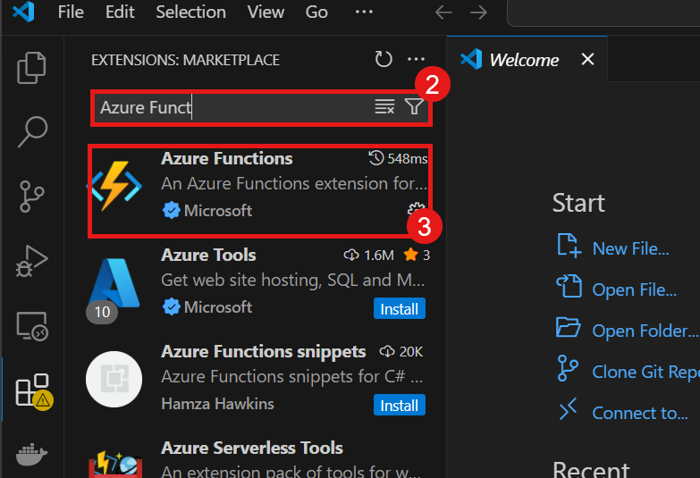

# Deploy a Function App using Visual Studio Code Which updates the logs when a new file is uploaded in the blob storage. #

## Overview

In this lab, you will install Azure extensions, sign in to Azure through Visual Studio Code, create and configure an Azure Function App, and deploy a function app that updates the logs when a new file is uploaded in the blob storage. You will also learn how to monitor the function app and troubleshoot any issues that arise.

---
### Tasks to be Completed
1. Install the necessary Azure extensions in Visual Studio Code, Python, and Azure Functions Core Tools.
2. Sign in to Azure from Visual Studio Code.
3. Create and configure a Function App.
4. Deploy a Function App using Visual Studio Code.
5. Monitor the Function App.

---
## Task 1: Install the necessary Azure extensions in Visual Studio Code, Python, and Azure Functions Core Tools.
1. Open **Visual Studio Code** and navigate to the **Extensions(1)** view.
    
    

2. **Search(2)** for **Azure Functions(3)** extension and install it.
   
    

3. Check if Python is Installed on Your System
Before proceeding, ensure Python is already installed. You can verify this by opening a terminal or command prompt and typing:
   ```bash
   python --version
   ```
    

4. Install the Azure Functions Core Tools. You can do this by running the following command in your terminal:
   ```bash
   npm install -g azure-functions-core-tools@4 --unsafe-perm true
   ```
    This command installs the Azure Functions Core Tools globally on your machine, allowing you to create and manage Azure Functions from the command line.
     
     

5. After installing the Azure Functions Core Tools, you can verify the installation by running the following command in your terminal:
   ```bash
   func --version
   ```

    This command should return the version of the Azure Functions Core Tools you just installed.
    
     

---
## Task 2: Sign in to Azure from Visual Studio Code
1. Click on the **Azure(1)** icon in the Activity Bar.
    
    

2. Click **Sign in to Azure(2)**.
   
    

3. A window will open. Click **Allow(3)** to proceed.
   
    

4. Enter your **Email Address(4)** and click **Next(5)**.
   
    

5. Click **Send Notification(6)** to complete the sign-in.
   
    

6. Approve the **sign-in request(7)** from your device.
   
    

7. Select your appropriate **Tenant(8)** and select your **subscription(9)**.
   
    

8. Then click on **Allow(10)** to login.
   
      

---
## Task 3: Create and Configure a Function App

1. In the **Visual Studio Code** click the following keyboard shortcut **Ctrl + Shift + P** to open the command palette(1).
   
    

2. Type **Azure Functions: Create New Project(2)** and select it.
   
    

3. Select a location for your project and click **Select Folder(3)**.
   
    

4. Select **Python(4)** as the language for your function app.
   
    

5. Select the **Python interpreter version** you want to use for your function app.

6. Select the **Blob Trigger(5)** template for your function app.
   
    

7. Enter a **name for your function app(6)** and click **Enter**.
   
    

8. Enter the **name of the Container(7)** you want to use for your function app and click **Enter**.
   
    

9. Select the **Create a new local.settings.json file** option.
   
10. Select the **Subscription(8)** in which you have hosted the storage account.
    
    

11. Select the **Use Azure Storage for remote storage(9)** option.
    
    

12. Select the **Storage Account(10)** you want to use for your function app(11).
    
    

13. Select The option **Open in current window(12)**.
    
    

14. It will start the process of creating the function app. Once it is done, you will see a new folder with the name of your function app in the **Explorer** view.
    
    

15. Now open the **local.settings.json** file and add the Storage Account connection string to the **AzureWebJobsStorage(13)** key.
    
    

    Hint: You can find the connection string in the **Azure Portal** by navigating to your Storage Account, selecting **Access keys(14)**, and copying the connection string from there.

    

16. Now open the terminal in Visual Studio Code and click Fn + F5 to run the function app locally.
    
    

17. You should see the following output in the terminal, indicating that the function app is running locally and waiting for a blob to be uploaded.
   
    

18. Now you have successfully created and configured a function app that will trigger when a new file is uploaded to the specified blob storage container. 

### Great work! Let’s move on to the next step to see it in action. ##

## Task 4: Deploy a Function App using Visual Studio Code

1. In the **Azure** panel, click on **WorkSpace** and select your **local project(1)** where function app is hosted from the list.
   
    

2. Right-Click on the **local project** and select **Deploy to Azure(2)** from the context menu.
    
    

3. Select the **Subscription(3)** in which you want to deploy the function app.
    
    

4. Create a new **Function App(4)** in the selected subscription.
    
    

5. Enter a name for your function app and click **Enter(5)**.
    
    

6. Select the **Location(6)** where you want to deploy the function app.
    
    

7. Select the **Runtime Stack(7)** for your function app.
    
    

8. Select the **Instance Memory Type(8)** for your function app(2048).
    
    

9. Enter the **100 in Maximum Number of Instances(9)** and click **Enter**.
    
    

10. Now the deployment process will start. You can monitor the progress in the **Output** panel.
    
    

11. It will show an popup message indicating that ** Are you sure you want to deploy the function app**. Click **Deploy(10)** to proceed.
    
    

12. Confirm Successful Deployment
Once the deployment is complete, you’ll see a confirmation message indicating that your Function App has been successfully deployed.
   
    

### **Deployment complete!** Your Azure Function App is now live and ready to respond to blob storage events.
---

## Task 5: Monitor the Function App

1. You can now navigate to the **Azure Portal** and check the **function app(1)** you just deployed.
   
    

2. You should see the function app listed there, along with its status and other details(2).
    
    

3. Navigate to the **Settings(3)** and select the **Environment Variables(4)** option from the left menu.
    
    

4. Now you can add the **AzureWebJobsStorage** connection string to the **Environment Variables** section.
    
    

5. Now go to the **Overview** section of the function app and navigate to the **Functions(5)** section.
    
    

6. Click on the **Function** you just deployed to view its details(6).
    
    
    
7. You can monitor the **logs** to see the events triggered by the blob uploads.
        
     

8. Now you can upload a file to the blob storage container you specified earlier and check the logs to see if the function app is triggered and logs the event.
    
    

## Congratulations! You have successfully deployed a Function App using Visual Studio Code and monitored its performance. ##
## Summary ##
In this lab, you learned how to install the necessary Azure extensions in Visual Studio Code, sign in to Azure, create and configure a Function App, deploy it, and monitor its performance. You also learned how to troubleshoot any issues that arise during the deployment process. This knowledge will help you in your future projects involving Azure Functions and cloud computing.
## Additional Resources ##
- [Azure Functions Documentation](https://docs.microsoft.com/en-us/azure/azure-functions/)
- [Azure Functions Core Tools Documentation](https://docs.microsoft.com/en-us/azure/azure-functions/functions-run-local)
- [Azure Storage Documentation](https://docs.microsoft.com/en-us/azure/storage/)
    

   
