# Deploy a Web Application Using Azure App Service

## Overview

In this lab, you will install Azure extensions, sign in to Azure through Visual Studio Code, create and configure an Azure App Service, and deploy a web application.

---

## Tasks to be Completed

1. Install Azure Extensions In Vs-Code
2. Sign in to Azure from Vs-code
3. Create and Configure a Web App
4. Deploy an Application using Visual Studio Code

---

# Task 1: Install Azure Extensions in VS Code

1. Open **Visual Studio Code** and navigate to the **Extensions(1)** view.

    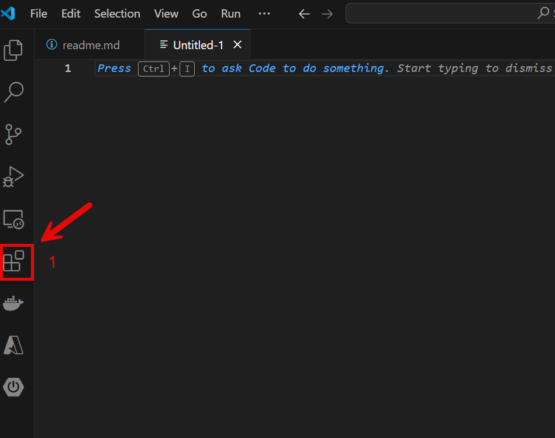

2. Search(2) for **Azure Resources(3)** extension and install it.

    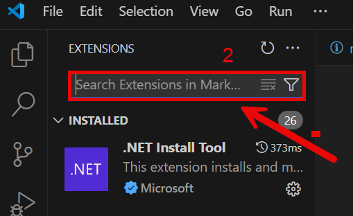

3. After installing Azure Resources, search for and install the **Azure App Service(4) & Azure Resources** extension.

    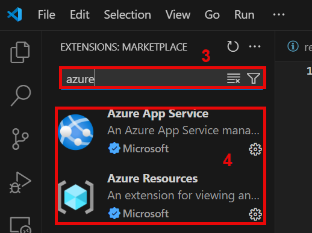

---

# Task 2: Sign in to Azure

1. Click on the **Azure(5)** icon in the Activity Bar to open the **Azure Resources** panel.

    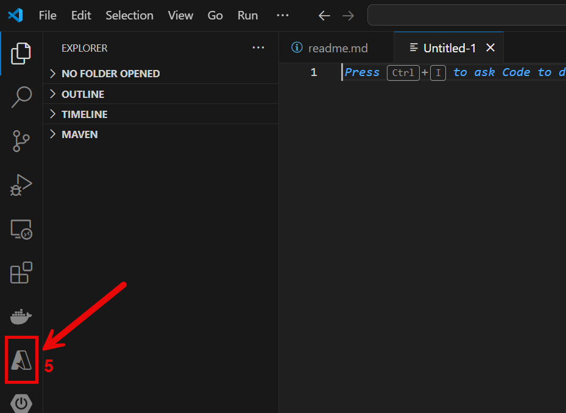

2. Click **Sign in to Azure(6)**.

    

3. A window will open. Click **Allow(7)** to proceed.

    

4. Enter your **Email Address(8)** and click **Next**.

    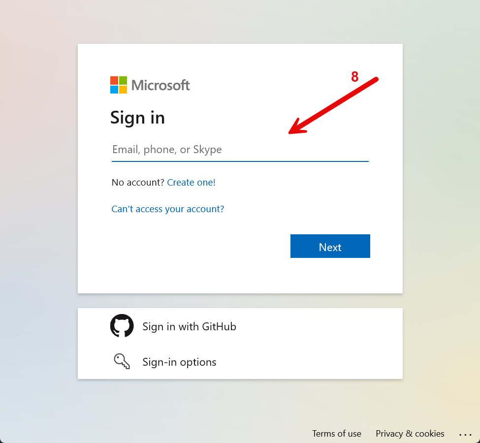

5. Click **Send Notification(9)** to complete the sign-in.

    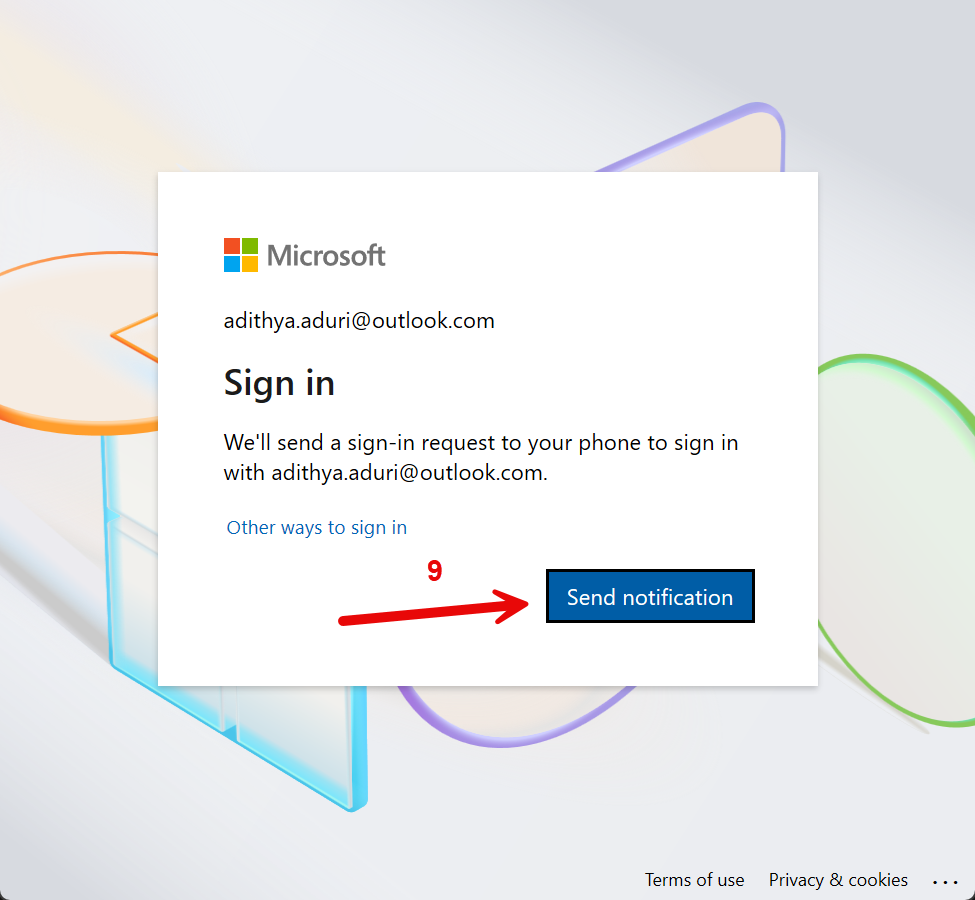

6. Approve the **sign-in request(10)** from your device.

    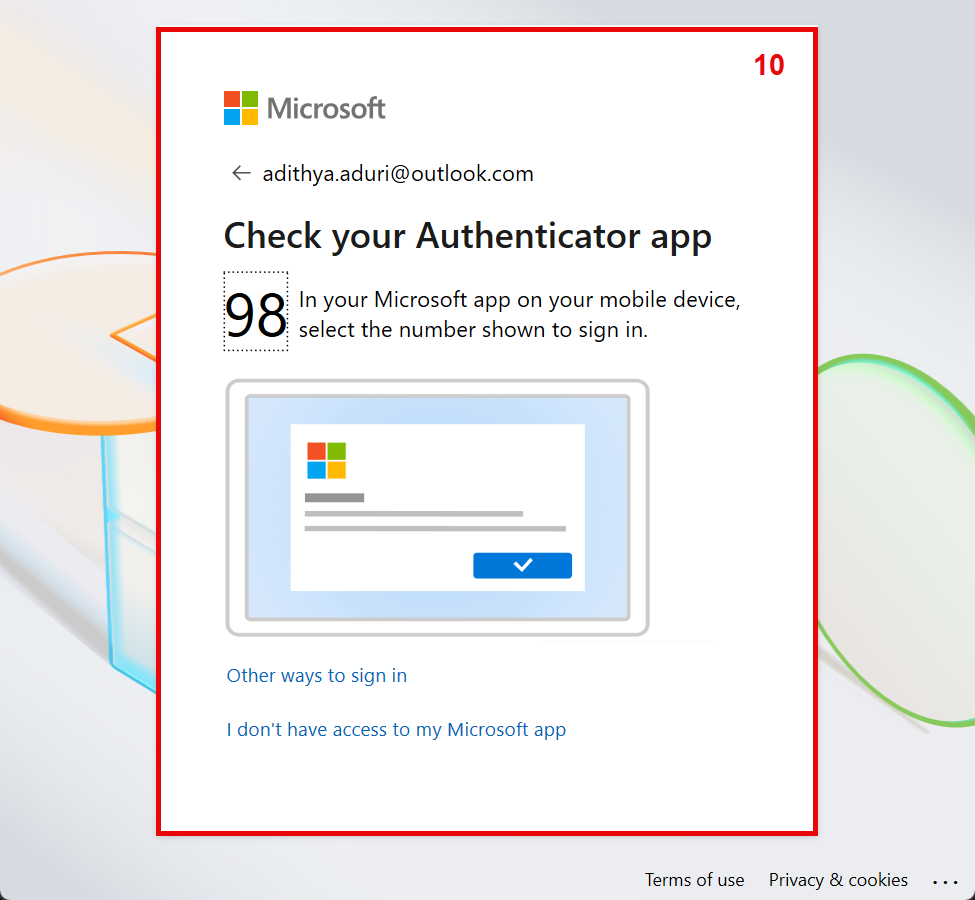

7. Select your appropriate **Tenant(12)** if required.

    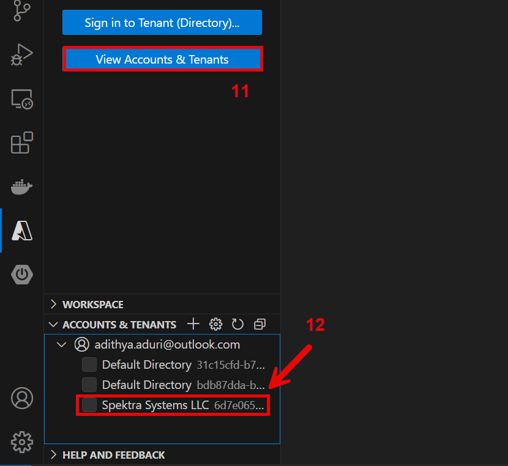

8. Then click on **Allow(13)** to login.

    

---

# Task 3: Create and Configure a Web App

1. In the **Azure** panel, click on **App Services(15)**.

    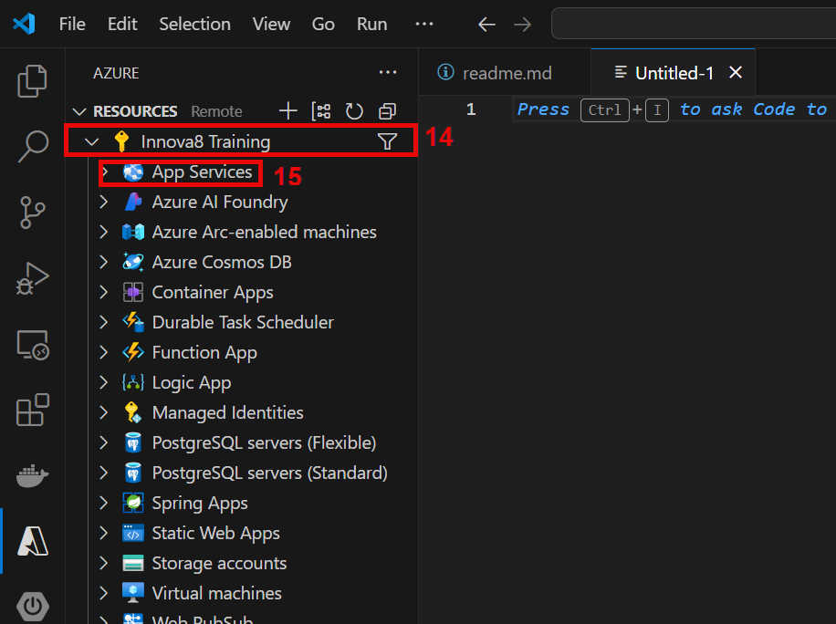

2. Click **+ Create New Web App(16)**.

    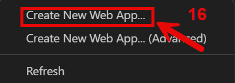

3. Select a **Region(17)**.

    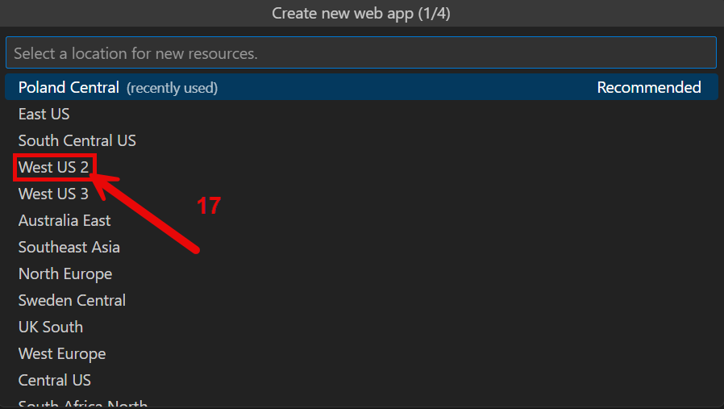

4. Provide a **Unique App Name(18)**.

    

5. Choose the **Runtime Stack(19)** — select **Java 17(20)** (or another as needed).

    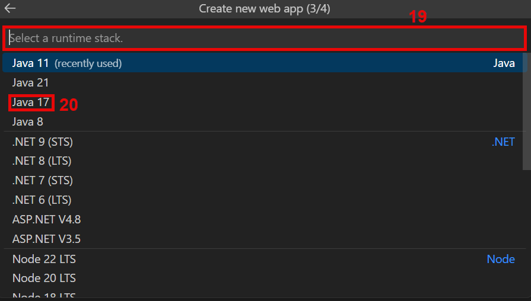

6. Select the **Web Server Stack(21)** — choose **Java SE**.

    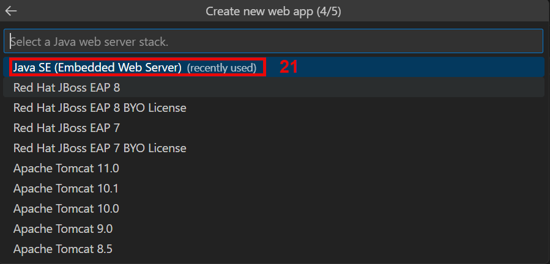

7. Select the **Pricing Tier** — choose **Free (F1)(22)**.

    

8. Web App deployment will begin automatically.

    

9. Monitor the status of the deployment and verify the settings(23).

    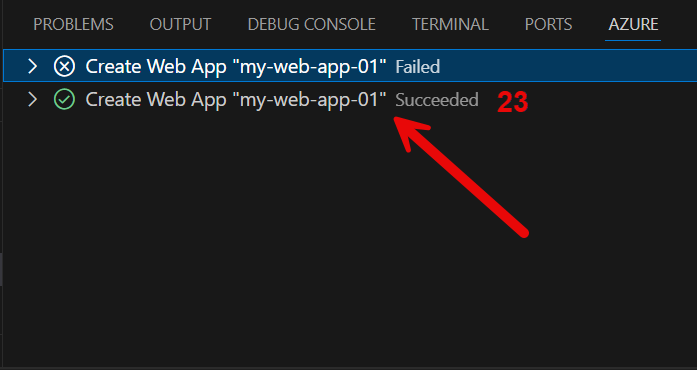

---

# Task 4: Deploy an Application to Web App

1. Create a local folder to store your application code.

    

2. After deployment, right-click on the created Web App in **App Services** and select **Deploy to Web App(26)**.

    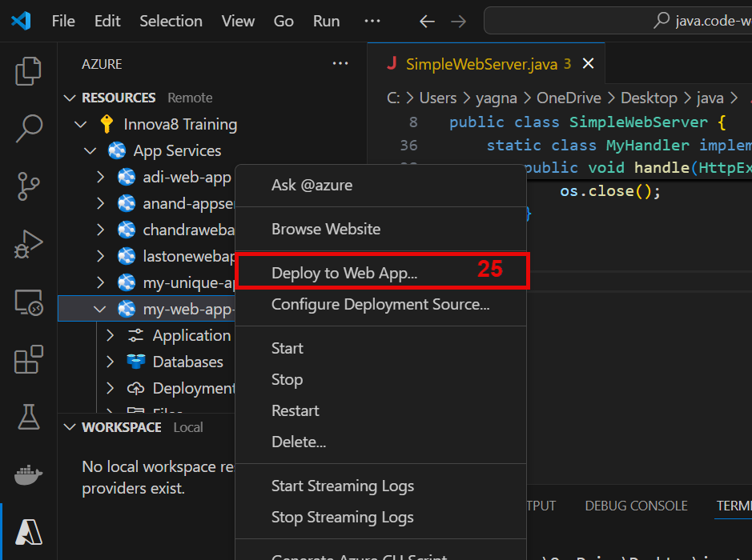

3. Select your **Application Folder(26)** where jar file is located for deployment.

    

4. Enter the **Port Range(27)** you wish to use and press **Enter**.

    

5. Confirm by clicking **Deploy(28)** in the popup window.

    

6. Upon successful deployment, VS Code will display a notification. Click **Browse Website(29)**.

    

7. Your web application will open in a **browser window(30)**.

    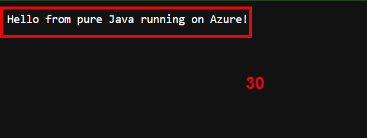

---

# End of Lab

---
