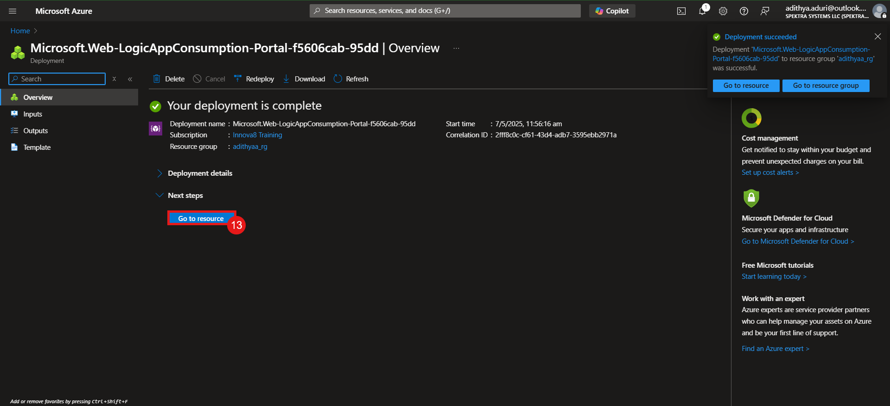

# Deploy a Logic App using Azure Portal which will be triggered by an http request and send an email to the user only if the request is from a specific user name.

## Overview

This lab guide will walk you through the process of deploying a Logic App using the Azure Portal. The Logic App will be triggered by an HTTP request and will send an email to the user only if the request is from a specific username.

---
### Task to be Completed
1. Login to Azure Portal.
2. Create a Logic App.
3. Configure the Logic App to trigger on an HTTP request.
4. Test the Logic App.
5. Monitor the Logic App.

---
### Task 1: Login to Azure Portal
1. Open your web browser and navigate to the [Azure Portal](https://portal.azure.com/).
  

2. Enter your Azure account credentials and click **Sign in**.
  

3. Once logged in, you will be directed to the Azure Portal dashboard.
  

#### You should now be logged into the Azure Portal and ready to create a Logic App.
---
### Task 2: Create a Logic App
1. In the Azure Portal, click on **search bar** and search for **Logic App** and click on the **Logic App** option from the dropdown.
  

2. Click on the **Create** button to start creating a new Logic App.
  

3. Fill in the required details for your Logic App:
   - **Subscription**: Select your Azure subscription.
   - **Resource Group**: Create a new resource group or select an existing one.
   - **Logic App Name**: Enter a unique name for your Logic App.
   - **Region**: Select the region where you want to deploy the Logic App.
   - And click on **review + create**.
  

5. Click on the **Create** button to create the Logic App.
  

6. Wait for the deployment to complete.
    

#### Your Logic App is now created Successfully!!!.
---
### Task 3: Configure the Logic App to trigger on an HTTP request
1. Once the Logic App is created, click on **Go to resource** to open the Logic App.
  

2. In the overview page of the Logic App, click on **Edit** to start designing the Logic App workflow.
  

3. In the Logic App Designer, click on **Add a trigger** to add a trigger to the Logic App.
  

4. Search for **Request** and select the **When an HTTP request is received** trigger.
  

5. In the parameters section, select the **POST** method in the **Method** dropdown and in the advanced parameters select **Relative path** and in the relative path create an new parameter called **name**.
 

6. Now click on the **+** icon to add a new action to the Logic App.
  

7. Now search for **Condition** and select the **Condition** action.
  

8. In the Condition action, set the condition to check if the **name** parameter equals the specific username you want to allow.
  

9. In the **If true** branch, add an action to send an email by selecting the **Send an email** action from the Outlook action.
  

10. Fill in the required details for the email action:
    - **To**: Enter the email address where you want to send the email.
    - **Subject**: Enter a subject for the email.
    - **Body**: Enter the body of the email.
  

11. In the **If false** branch, you can add an action to display the error message.
    - **Response**: Select the **Response** action and set the status code to **403 Forbidden** and add a message in the body as **403 Forbidden**.

    

12. Now click on **Save** to save the Logic App workflow.
  

### Your Logic App is now configured to trigger on an HTTP request and send an email if the request is from a specific username.
---
### Task 4: Test the Logic App

1. In the Logic App Designer, click on the **Run Trigger** button to test the Logic App.
  

2. Now cick on the **http GET URL** to copy the URL for the HTTP request.
  

3. Open a new browser tab and paste the copied URL in the address bar and append **?name=your_username** to the URL.

    

4. Press **Enter** to send the HTTP request.
  
    

5. Check your email inbox to see if you received the email.
  
    

6. If the data is not from the specific username, you will receive a **no valid name** response.
    
      

  
